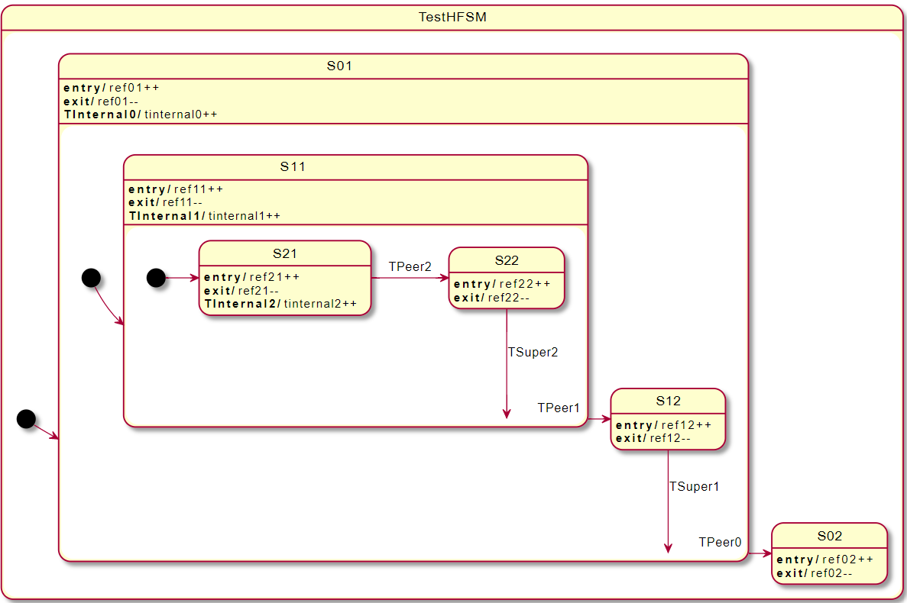

The HFSM implementations have limited state transition support. The following scenarios should be tested:

1. Internal transitions: current state doesn't change.
1. Substate transitions: from a super state to a sub-state.
1. Peer transitions: between two peer states.

Substate and peer transitions may happen from a super-state of the current state.

Test matrix for all supported transitions:

| Transition | Test transition from states |
|---|---|
| TSub0 | Init |
| TSub1 | S01 |
| TSub2 | S11 |
| TSuper1 | S12 |
| TSuper2 | S22 |
| TPeer0 | S01, S11, S12, S21, S22 |
| TPeer1 | S11, S21, S22 |
| TPeer2 | S21 |

Tests will check that all refNN variables are 1 after entering all substates and the substates revert to 0 after they have been exited.
